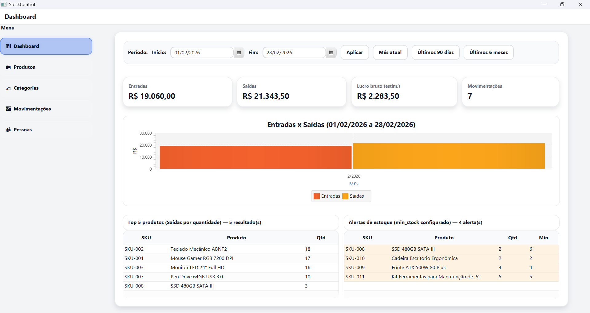
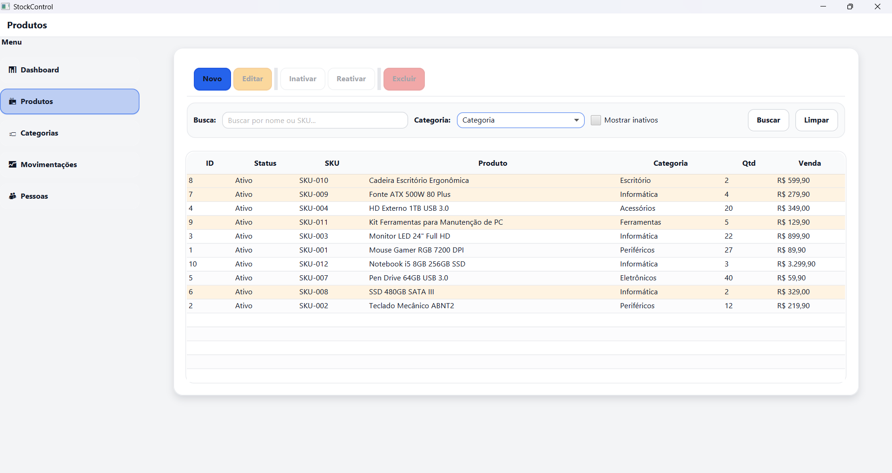
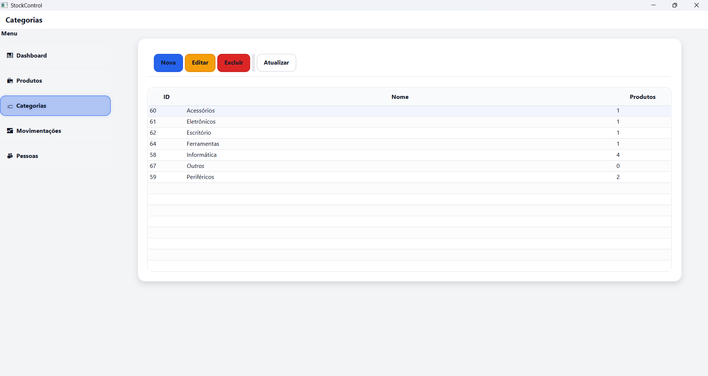
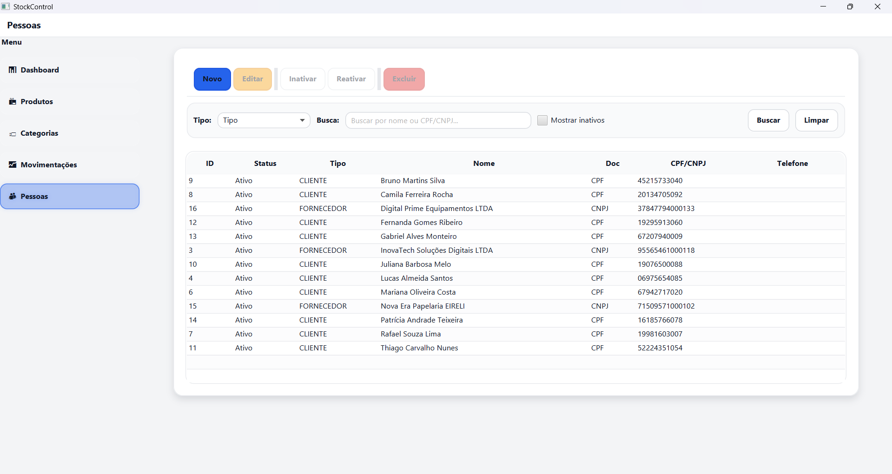
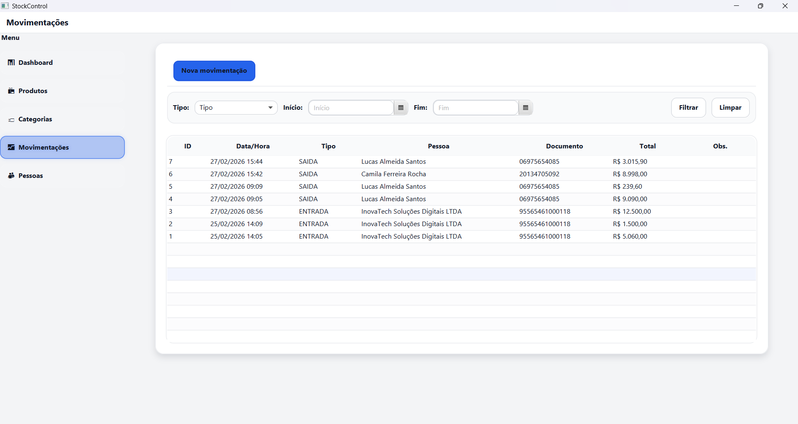

# StockControl — Controle de Estoque (JavaFX + SQLite)

Aplicação desktop de controle de estoque construída com **Java 21**, **JavaFX 21** e **SQLite**.  
O foco do projeto é ser **simples**, **funcional** e com boas práticas de integridade (FKs), UX e estrutura de camadas (**UI → DAO → SQLite**).

---

## Demonstração (telas)

### Dashboard


### Produtos (com destaque de baixo estoque)


### Categorias


### Pessoas (Clientes/Fornecedores)


### Movimentações (Entrada/Saída)


---

## Funcionalidades

### Produtos
- Cadastro e edição de produtos (nome, SKU, categoria, preço de venda, estoque mínimo).
- **SKU automático** no cadastro (ex.: `SKU-001`, `SKU-002`, ...).
- **Estoque controlado por movimentações** (quantidade não é alterada manualmente no cadastro).
- Destaque visual na tabela:
  - **Estoque zerado** (vermelho)
  - **Estoque baixo** (laranja) quando `quantidade <= estoque mínimo`
- **Inativar / Reativar** produto e filtro **“Mostrar inativos”**.
- **Não permite excluir** produto com movimentações (integridade via FK). Em caso de bloqueio, a interface sugere **inativar**.

### Categorias
- Cadastro de categorias.
- Categoria padrão/fallback (ex.: “Geral”) para facilitar uso inicial.

### Pessoas (Clientes/Fornecedores)
- Cadastro com:
  - Tipo: **Cliente** ou **Fornecedor**
  - Documento **CPF/CNPJ** com validação
  - Contato e endereço
- **Inativar / Reativar** e filtro **“Mostrar inativos”**.
- **Não permite excluir** pessoa com movimentações (integridade via FK). Em caso de bloqueio, a interface sugere **inativar**.

### Movimentações (Entrada/Saída)
- Movimentações com cabeçalho e itens:
  - **Entrada** vinculada a **Fornecedor**
  - **Saída** vinculada a **Cliente**
- Registro de itens com quantidade, valor unitário e subtotal.
- Controle de integridade com chaves estrangeiras e validações na camada DAO/UI.

### Dashboard
- Tela de visão geral do sistema (base para KPIs e evolução do projeto).

---

## Tecnologias
- **Java 21**
- **JavaFX 21**
- **SQLite** (JDBC)
- **Maven**
- UI com **FXML** + tema em **CSS** (`app.css`)

---

## Como executar

### Requisitos
- Java **21+**
- Maven **3.9+**

### Rodar
```bash
mvn clean javafx:run
```

O banco SQLite é criado automaticamente em:
- `./data/stockcontrol.db`

---

## Banco de dados e migrações

O projeto usa versionamento de schema via:

- `PRAGMA user_version`

Ao iniciar:
1. Verifica a versão do banco
2. Executa migrações necessárias
3. Atualiza a versão

Pontos principais do modelo:
- Tabelas de **produtos**, **categorias**, **pessoas (clientes/fornecedores)** e **movimentações**
- Campo `active` em **pessoas** e **produtos** para permitir inativação/reativação
- Foreign keys para garantir histórico e integridade (evita excluir entidades já usadas)

---

## Estrutura (visão geral)
- `.../ui/` telas
- `.../ui/controller/` controllers
- `.../dao/` acesso ao SQLite
- `.../db/` conexão e migrações
- `.../resources/.../ui/` FXML e CSS